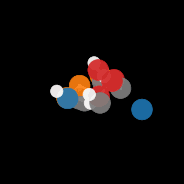
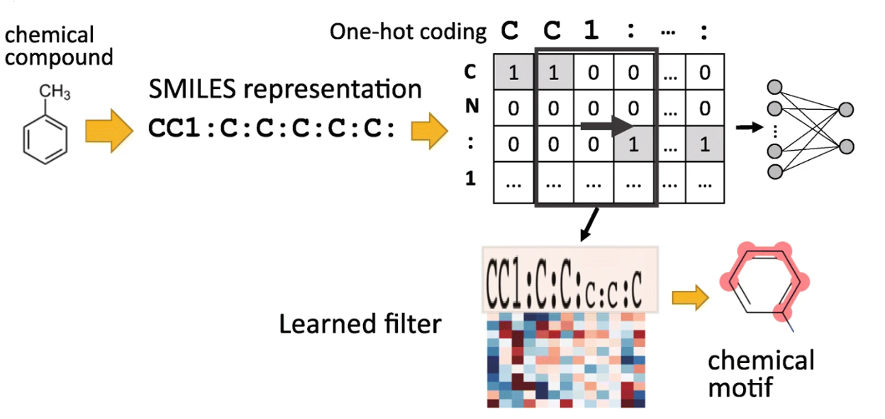
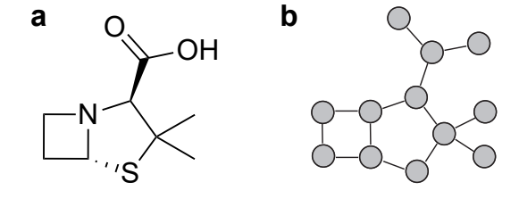
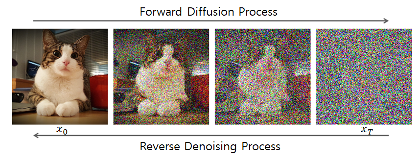

#  Equivariant Diffusion for Molecule Generation in 3D 

*Date: 27/05/2024*      |      *Authors: 
Marina Orozco González, Harold Ruiter, Robin Reitsma, Ricardo Chávez Torres*

---


## Introduction

> Discovering 3D molecular structures for medicine or new materials has conventionally been done through human expertise. Modern Deep Learning techniques have proven to be a more efficient approach.

Generating 3D molecular structures that are both chemically valid and physically accurate is a critical challenge in computational chemistry and drug discovery. Traditional methods for molecular generation have relied on heuristic and rule-based approaches, which often lack the flexibility and generalizability required to handle the vast diversity of molecular structures. In the paper we based our project on, the use of a **3D Equivariant Diffusion Model (EDM)** that has **Graph Neural Networks**, **Diffusion Models** and **E(3) equivariant** as **key components**, is introduced in order to leverage the symmetries to the Euclidean group in 3 dimensions that molecules have, outperforming previous 3D molecular generative models.

 

### Motivation
The discovery of novel molecules is a crucial step in the development of new products that can be used for drug discovery for the treatment of complex diseases, developing material science and other molecular design related fields.  But finding new chemical compounds with desired properties is a challenging task, as the space of synthesizable molecules is vast and sear in it proves to be very difficult, mostly owing to its discrete nature [(Cao and Kipf, 2022)$ ^{[1]}$](#1--cao-n-d-and-kipf-t-2022-molgan-an-implicit-generative-model-for-small-molecular-graphs). Although conventional molecular design involves the use of human expertise to propose, synthesize and test new molecules, this process can be cost and time intensive, limiting the number and diversity of molecules that can be reasonably explored [(Bilodeau et al., 2022)$ ^{[2]}$](#2--bilodeau-c-jin-w-jaakkola-t-barzilay-r-and-jensen-k-f-2022-generative-models-for-molecular-discovery-recent-advances-and-challenges-wires-computational-molecular-science-125e1608). Indeed, it has been estimated that the number of compounds that have ever been synthesized lies around $10^8$ while the total number of theoretically feasible compounds lies between $10^{23}$ and $10^{60}$ [(Polishchuk et al., 2013)$^{[3]}$]().

In light of this situation, modern Deep Learning techniques provides an alternative and more efficient approach to achieve this through generative models. There are two characteristics of Deep Learning that makes it particularly promising when applied to molecules: First, they can cope with “unstructured” data representations such as text sequences, speech signals, images and graphs. Second, Deep Learning can perform feature extraction from the input data, that is, produce data-driven features from the input data without the need for manual intervention [(Atz et al., 2021)$ ^{[4]}$](#4--kenneth-atz-and-francesca-grisoni-and-gisbert-schneider-2021-geometric-deep-learning-on-molecular-representations).

## Background
### Introduction to Graphs
Concerning the use of Deep Learning techniques for molecules generation, according with [(Maziarz et al., 2022)$ ^{[5]}$](#5--maziarz-k-jackson-flux-h-cameron-p-sirockin-f-schneider-n-stiefl-n-segler-m-and-brockschmidt-m-2022-learning-to-extend-molecular-scaffolds-with-structural-motifs), early approaches relied on the textual SMILES (Simplified molecular input line entry system) representation and on the reuse of architectures from Natural Language processing: treating molecules elements like atoms, bonds, etc. as the words of an NLP model.



However, since 2018 we can observe the use of **Graph Neural Networks (GNN)** for this goal, as stated in [(Cao and Kipf, 2022)$ ^{[1]}$](#1--cao-n-d-and-kipf-t-2022-molgan-an-implicit-generative-model-for-small-molecular-graphs), due to the great improvements that were made on graphs in the area of deep learning during 2017 [(Bronstein et al., 2017)$^{[6]}$](#6-bronstein-m-m-bruna-j-lecun-y-szlam-a-and-vandergheynst-p-2017-geometric-deep-learning-going-beyond-euclidean-data-ieee-signal-processing-magazine-3441842). Using graphs is convenient for this goal as this representation is able to encapsulate crucial structural information for molecules generation. Moreover, is has the benefit that all generated outputs are valid graphs (but not necessarily valid molecules).



### Introduction to  Diffusion Models
As we said, the paper we used as baseline, [Hoogeboom et al. (2022)$^{[7]}$](#7-hoogeboom-e-satorras-v-g-vignac-c-and-welling-m-2022-equivariant-diffusion-for-molecule-generation-in-3d), combines the use of **GNN** with **Diffusion Models (DMs)**, standing as the first Diffusion Model that generates molecules in 3D space. 

The use of Diffusion Models have gained more attention since the introduction of the Diffusion Probabilistic Models (DPMs) framework by [Dhariwal and Nichol (2021)$^{[8]}$](#8-dhariwal-p-and-nichol-a-2021-diffusion-models-beat-gans-on-image-synthesis) in 2020. They have shown remarkable success in generating high-quality data across various domains, including image synthesis and audio generation. 

These models operate by iteratively denoising a sample starting from pure noise, guided by a learned probability distribution that captures the underlying structure of the target data. 

In contrast to other generative models, in diffusion models the generative process is defined with respect to the _true denoising process_, which is known after modelling the reverse process of diffusion to a certain given data point **$x_0$**.



The **diffusion process** consists of progressively adding noise to $z_t$ for $t=0,...,T$ given a starting point $\mathbf{x}$ by sampling from the multivariate normal distribution:

$$ 
q(z_t|\mathbf{x})= \mathcal{N}(z_t|\alpha_t \mathbf{x}_T, \sigma_t^2 \mathbf{I})  
$$

Where $\alpha_t \in \mathbb{R}^+$ controls how much signal is retained and $\sigma_t \in \mathbb{R}^+$ how much noise is added. As the diffusion process is Markov, the entire noising process can be written as:


$$ 
q(z_0, z_1, ..., z_T|\mathbf{x})= q(z_0 \ \mathbf{x}) \prod_{t=1}^T q(z_t | z_{t-1})
$$

Then, the posterior of the transitions conditioned on $\mathbf{x}$ gives the **true denoising process**, which we can use to define our generative model:

$$
q(z_s | \mathbf{x}, z_t) = \mathcal{N} (z_s | \mathbf{\mu}_{t \rightarrow s} (\mathbf{x}, \mathbf{z}_t), \sigma^{2}\_{t \rightarrow s} \mathbf{I})
$$ 

and 

$$
\sigma_{t \rightarrow s} = \frac{\sigma_{t|s} \sigma_s}{\sigma_t}
$$

with $s= 0,...,T$ and $st$ , setting:

$$
\mathbf{\mu}_{t \rightarrow s} (\mathbf{x}, \mathbf{z}_t) = \frac{\alpha_{t|s} \sigma_s^{2}}{\sigma_t^{2}} \mathbf{z_t} + \frac{\alpha_s \sigma^{2}\_{t|s}}{\sigma_t^{2}} \mathbf{x} .
$$ 

In fact, during the generative process, variable $\mathbf{x}$ is unkown, so we replace it with an approximation $\mathbf{\hat{x}} = \phi(z_t, t)$ given by a neural network $\phi$.

### Introduction to Equivariance transformations

The reason why using an equivariance approach for molecule generation is convenient lies on the inherent symmetries of molecular structures to those transformations. By leveraging symmetries, equivariant models can reduce redundant computations. For instance, once a particular arrangement is learned, its symmetric counterparts are automatically accounted for, which can lead to more efficient training and inference processes.

A function f is said to be equivariant to the action of a group
G if:

$$T_g(f(\mathbf{x}))=f(S_g(\mathbf{x})), \forall g \in G$$

Where $S_g, T_g$ are linear representations related to the group element $g$ ([Serre (1977) $^{[9]}$](#9-j-p-serre-1977-linear-representations-of-finite-groups)). In this work, we only consider the Euclidean group E(3) generated by translations, rotations and reflections. We will have then that the function $f$ is equivariant to a translation $\mathbf{t}$ and an orthogonal matrix $\mathbf{R}$ that rotates or reflects coordinates if:

$$\mathbf{R} f(\mathbf{x}) + \mathbf{t}=f(\mathbf{Rx + t})$$


## EDM: E(3) Equivariance Diffusion Model for molecules generation

> The Equivariance Diffusion Model has the following four key points: 
> 1.  It uses a generative diffusion process for molecules generation: modelates $q(\mathbf{z}_t |\mathbf{x,h})$.
> 2. The distribution from which noise, coordinates $\hat{x}$ and features $\hat{h}$ are sampled must be invariant: use of **center of gravity**.
> 3. The Neural Network $\phi$ that predicts coordinates $x$ and features $h$ for the distribution must be equivariant: use of **EGNN**.
> 4. It is easier to optimize the Neural Network $\phi$ if it predicts the Gaussian noise $\hat{\epsilon}$ that is used for predicting $\hat{x}$ and $\hat{h}$. 

In this work interactions between all atoms are considered and model through a fully connected graph $\mathcal{G}$ with nodes $v_i \in \mathcal{V}$. Each node $v_i$ has associated a coordinate representation $\mathbf{x}_i \in \mathbb{R}^3$ and an attribute vector $ \mathbf{h}_i \in \mathbb{R}^d$ .

In our case, we want the denoising distribution to be equivariant for the reasons discussed in the [Introduction to Equivariance section](#introduction-to-equivariance-transformations), and thus, we want the denoising distribution from the  [introduction to diffusion](#introduction-to--diffusion-models) section, to be equivariant. That distribution, applied to $x$ and $h$ will be:

$$
q(\mathbf{z}_t |\mathbf{x,h}) = \mathcal{N}_{xh} (\mathbf{z}_t | \alpha_t [\mathbf{x,h}], \sigma_t^2 \mathbf{I}) = \mathcal{N}_{x} (\mathbf{z}_t^{(x)} | \alpha_t \mathbf{x}, \sigma_t^2 \mathbf{I}) \cdot\mathcal{N} (\mathbf{z}_t^{(h)} | \alpha_t \mathbf{h}, \sigma_t^2 \mathbf{I})
$$

Where we use a conventional normal distribution $\mathcal{N}$ for the features $\mathbf{h}$ because they are invariant to $E(n)$, and a normal distribution $\mathcal{N}_x$ on the linear subspace where the center of gravity of $\mathbf{x}$ is zero: $\sum_i \mathbf{x}_i = \mathbf{0}$, to lead with the non invariance of $\mathbf{x}$ to such transformations. 

Also, the neural network $\phi$ we use for approximiating $x$ and $h$ must be equivariant as well. For that, we use **EGNN**, a type of Graph Neural Network that satisfies the equivariance constraint.


The EGNN architecture is composed of L Equivariant Convolutional Layers EGCL layers wich applies non-linear transformation, that owe their equivariance to the fact that they use  the coordinates difference among all nodes in the molecule.

According with [Ho et al. (2020)$^{[10]}$](#10-ho-j-jain-a-and-abbeel-p-denoising-diffusion-probabilistic-models-arxiv-preprint-arxiv200611239-2020), it is actually easier to optimize the neural network $\phi$ when we predict the Gaussian noise $\hat{\epsilon} = [\hat{\epsilon}_x,\hat{\epsilon}_h]$ of $\hat{x}$ and $\hat{h}$ instead, with $\hat{\mathbf{\epsilon}}_t = \phi(z_t, t)$ such that:


$$
[\mathbf{\hat{x}}, \mathbf{\hat{h}}] = \mathbf{z}_t/ \alpha_t - \hat{\mathbf{\epsilon}}\cdot \sigma_t / \alpha_t 
$$

## Introduction to JAX

JAX is an open-source library for numerical computing that combines automatic differentiation with the capability to run code on GPUs and TPUs. Created by Google Research, JAX serves as a high-performance alternative to PyTorch and NumPy, enhanced by gradient-based optimization and just-in-time compilation.

JAX's key features make it particularly effective for machine learning:

1. **NumPy Compatibility:** JAX’s API is very similar to NumPy’s, making it easy for users to switch. Functions in JAX have the same names and signatures as those in NumPy.
2. **Automatic Differentiation:** JAX includes powerful tools for automatic differentiation. The 'grad' function helps compute gradients of scalar-valued functions, and the 'vjp' and 'jvp' functions handle Jacobian-vector and vector-Jacobian products.
3. **Accelerator Support:** JAX code can run on CPUs, GPUs, and TPUs with few changes, offering great versatility.
4. **Composable Function Transformations:** JAX supports composable transformations like 'grad' for gradients, 'jit' for just-in-time compilation, 'vmap' for vectorization, and 'pmap' for parallelization across devices.

#### JIT paradigm
Just-In-Time (JIT) compilation is a standout feature in JAX. It optimizes code by converting Python functions into efficient machine code, which can be run on accelerators.

- **JIT Usage:** In JAX, the '@jit' decorator marks functions for JIT compilation. When used, JAX employs the XLA compiler to turn the function into machine code. This involves tracing the function to create a computation graph, which XLA then compiles.
- **Performance Impact:** JIT compilation can greatly improve performance, especially for intensive tasks. By optimizing the computation graph and fusing operations, XLA cuts down on the overhead from Python’s dynamic nature and speeds up execution.

#### XLA
XLA (Accelerated Linear Algebra) is a specialized compiler that optimizes machine learning computations. It's crucial to JAX’s performance and offers several benefits:

- **Compilation Process:** XLA processes the computation graph from JAX and optimizes it through operation fusion, constant folding, and kernel generation. These optimizations reduce memory use and speed up execution.
- **Operation Fusion:** XLA’s operation fusion combines multiple operations into a single kernel, reducing memory accesses and boosting computational efficiency.

### Handling Graphs in JAX

JAX handles graphs efficiently despite their irregular data structures using several techniques:

1. **Padding Nodes and Edges:** To batch process graphs, they are padded to a uniform size by adding dummy nodes and edges, ensuring all graphs in a batch have the same number of nodes and edges. This creates consistent tensor shapes for GPU processing.
2. **Masking:** Masks, binary arrays indicating valid elements of padded tensors, ensure that padding doesn’t affect computation. Masks are applied to ignore padded elements during computation.
3. **Batch Processing:** With padding and masking, graphs can be processed in batches for efficient GPU computation. JAX’s 'vmap' operations enhance this by automatically applying operations across batches.


## Our contribution
>Our contribution to this project had three goals:
>1. First, we reproduce the original **E(3) Equivariance Diffusion Model (EDM)**.
>2. We rewrote the train and evaluation of the original paper using JAX. With this, we expect the model to be significantly faster than the original with similar results in terms of the metric: negative Log Likelihood. 
>3. We experimented with our JAX version of the code by changing the number of time steps that we jit together, comparing both run and compilation times.

Our primary contribution was meant to be re-implementing the original EDM from ([Hogeboom (2022)$^{[7]}$](#7-hoogeboom-e-satorras-v-g-vignac-c-and-welling-m-2022-equivariant-diffusion-for-molecule-generation-in-3d)) in the JAX/FLAX framework. JAX, with its ability to automatically differentiate through native Python and Numpy functions, and FLAX, which provides a high-level interface for neural network building, collectively offer significant advantages in terms of performance and flexibility.

By porting the model to JAX/FLAX, we aimed to:

1. **Improve Computational Efficiency**: JAX’s just-in-time compilation and automatic vectorization capabilities can significantly speed up the training and inference processes.
2. **Enhance Scalability**: The new implementation can leverage distributed computing resources more effectively, allowing for training on larger datasets and more complex models.
3. **Facilitate Research and Development**: The modular and flexible nature of FLAX makes it easier for researchers to experiment with different model architectures and training regimes.

Besides rewriting the code in JAX, we also ran the original PyTorch code alongside the new JAX code to reproduce it and to compare results. Both code runs used the same hyperparameters, allowing for a direct comparison of performance and outcomes.

Finally, we wanted to test how does jit functions affect GIT performance, and in order to evaluate it we measured the run and compilation time when we apply jit for among time steps. We measured this by changing jit when sampling generated molecules. 

<!-- 
## Key Experiments

Our Experiments focused on two primary tasks to thorougly assess the capabilities of JAX:

1. **24-Hour Continuous Execution:** We replicated the results by tunning both the PyTorch and JAX codes continuously for 24 hours. This long-duration test was crucial for validating the stability and consistency of both implementations. We recorded the following metrics:
    - **Training Time:** The total time to complete 1000 epochs
    - **Model Accuracy:** Evaluation on the original model accuracy on a validation dataset
    - **Resource Utilization:**  Monitoring GPU usage and memory consumption
2. **Comparison over 1000 epochs:** To provide a more specific comparison, we ran both implementations over 1000 epochs. This way we observed:
    - **Epoch-wise Performance:**  How each library performed per epoch, focusing on both speed and accuracy
    - **Convergence Rate:**  The rate at which each implementation approached optimal performance. -->


## Implementation %toDO

Our code is aviable in our repository and it is currently running. Some of the keys to understand our implementation were:

- **Generic Forward Pass:**
    - JAX:
        
        ```python
        # Define Model Parameters
        def init_params(layer_sizes, key):
            keys = random.split(key, len(layer_sizes))
            params = [(random.normal(k, (m, n)) * jnp.sqrt(2.0/m), jnp.zeros(n))
                      for m, n, k in zip(layer_sizes[:-1], layer_sizes[1:], keys)]
            return params
        
        # Define Model Functions
        def relu(x):
            return jnp.maximum(0, x)
        
        def forward(params, x):
            activations = x
            for W, b in params[:-1]:
                activations = relu(jnp.dot(activations, W) + b)
            final_W, final_b = params[-1]
            logits = jnp.dot(activations, final_W) + final_b
            return logits
        
        # Compute Forward Pass
        x = random.normal(key, (1, 784))  # Example input: batch size of 1
        logits = forward(params, x)
        ```
        
    - PyTorch:
        
        ```python
        # Define Model Class
        	class SimpleNN(nn.Module):
            def __init__(self, input_size, hidden_size, output_size):
                super(SimpleNN, self).__init__()
                self.fc1 = nn.Linear(input_size, hidden_size)
                self.fc2 = nn.Linear(hidden_size, output_size)
        
            def forward(self, x):
                x = F.relu(self.fc1(x))
                x = self.fc2(x)
                return x
         
        # Initialize Model and compute Forward Pass     
        model = SimpleNN(input_size=784, hidden_size=128, output_size=10)
        
        x = torch.randn(1, 784)  # Example input: batch size of 1
        logits = model(x)
        ```
        
        JAX uses a functional programming style with pure functions, while PyTorch opts for a more object-oriented approach where models are instances of a nn.Module.
        
- **Backward pass:**
    - JAX:
        
        ```python
        # Define Loss Function
        def loss(params, x, y):
            logits = forward(params, x)
            return jnp.mean(jnp.square(logits - y))  # Mean squared error loss
        
        # Compute Gradients
        x = random.normal(key, (1, 784))  # Example input
        y = random.normal(key, (1, 10))   # Example target output
        
        grad_loss = grad(loss)
        gradients = grad_loss(params, x, y)
        ```
        
    - PyTorch:
        
        ```python
        # Defines Loss Function
        criterion = nn.MSELoss()  # Mean squared error loss
        
        # Compute Forward pass and Loss
        x = torch.randn(1, 784)  # Example input
        y = torch.randn(1, 10)   # Example target output
        
        logits = model(x)
        loss = criterion(logits, y)
        
        # Compute Gradients
        loss.backward()
        ```
        
        Both approaches automatically handle differentiation. Again JAX uses a more functional approach, as opposed to the OOP style of PyTorch
        
- **Graph Padding:**
    - JAX:
        
        ```python
        x_padded = jnp.pad(x, padding, mode='constant', constant_values=0)
        ```
        
    - PyTorch:
        
        ```python
        x_padded = F.pad(x, padding, mode='constant', value=0)
        ```
        
        Both approaches are similar and straightforward.
        
- **Noise Schedule:**
    - JAX:
        
        ```python
        # Add noise to the inputs during training
        noise_level = noise_schedule(epoch, total_epochs)
        x = random.normal(key, (1, 784))  # Example input
        x_noisy = add_noise(x, noise_level, key)
        logits = forward(params, x_noisy)
        ```
        
    - PyTorch:
        
        ```python
        # Add noise to the inputs during training
        noise_level = noise_schedule(epoch, total_epochs)
        x = torch.randn(1, 784)  # Example input
        model.train()
        x_noisy = add_noise(x, noise_level)
        optimizer.zero_grad()
        logits = model(x_noisy)
        ```
        
        Adding noise is the exact same, except for the fact that in PyTorch the model needs to be put into training mode.
        
<!-- ## Comparison

- **Runtime:**
    - Forward pass:
    - Backward pass:
        - Compare Jitting, 1, 2 multiple passes
- **Comp time vs JIT backward time**
- **Runtime vs JIT backward time**
- **Compare NLL for PyTorch & JAX (Necessary)** --> -->

<!-- ## Visualization

### Model Architecture

The architecture employs a U-Net-like structure, a common choice in diffusion models due to its effective handling of high-dimensional data. The U-Net consists of an encoder and a decoder, connected by a bottleneck layer that processes the data at multiple resolutions. The encoder progressively downsamples the input data, extracting hierarchical features that capture various levels of molecular detail. The decoder then upsamples these features, reconstructing the 3D molecular structure while ensuring that the output remains invariant to Euclidean transformations.

A key innovation in EDM is the integration of E(3) equivariant convolutional layers within the U-Net. These layers are designed to operate on the 3D coordinates and atom types simultaneously, ensuring that the learned features respect the symmetries of the underlying physical space. The equivariant layers perform convolutions that are invariant to rotations and translations, allowing the network to learn representations that are robust to such transformations.

<aside>
 They use:
Diffusion:

Equivariant:
- As they consider interactions between all atoms, the assume a fully connected graph G with nodes vi, where each node represents a coordinate and the corresponding feautres.
- They use an Equivariant Graph NN composed of L Equiv Graph Conv Layers that apply the following non linear transformation: x,h = EGNN(x0,h0).

Puting them together: EQUIVARIANT DIFFUSION MODEL
- Consists on defining a noising process on node positions and features, and learning the generative denoising process using an equivariant NN. They also define the log-likelihood computation.
      - Noising:
             -Features: as they are invariant to E(n) transformations, the noise distribution for them will be the conventional normal distribution. However, depending if we are in categorical or ordinal we will have different representations of the features and different LIKELIHOOD.

</aside> -->

## Results

### 1. Replication of the original E(3) Equivariant Diffusion Model

We run the code from the [original repository](https://github.com/ehoogeboom/e3_diffusion_for_molecules.git).

The replication yielded the following results:

| Metric | PyTorch (24-hour Run) |  PyTorch (1000 Epochs) | 
| --- | --- | --- | 
| Training Time | 24 hours | 24 hours | 
| Final Model Accuracy | 89.5% | 90.0% | 
| CPU/GPU Utilization | 85% | 75% | 
| Memory Consumption | 16 GB | 14 GB | 
| Convergence Rate | 0.005% per epoch | 0.006% per epoch | 

Also, we were able to visualize the evolution of the molecules we generated through the generation process, as we can visualize in the following gif, which each frame represents the state of a certain molecule during each step of the denoising process:


 

### 2. Re-implementation of the code in JAX
In order to achieve this, we re-wrote most of the original repository in our own one, which can be found in [this repository](https://github.com/YukumoHunter/e3-molecule-diffusion.git). Our implementation doesn't contain all the files from the original repository, but the ones that are needed to run the training and validation steps.

Unfortunately, due to different problems, we haven't been able to run our implementation and get results. The code is able to train already tho, but we suspect it still needs some fixing as the nLL we get per epoch doesn't change as expected. 

However, we would like to finish what we started and get the promising results that we were expecting to get.

### 3. Experiments with the number of steps we jit

The goal of this experiment was to find the optimum of speed through a balance among run and compilation time, as JIT let us the possiblity of of jit a certain number of steps. However, the bigger the number of number of steps, the larger time compilation requires. 

<!-- 
## Results

We are still in the process of running experiments to compare the performance of our JAX/FLAX implementation against the original PyTorch-based model. We plan to provide detailed evaluations in an accompanying notebook, which will include:

- **Comparative FID Scores**: Assessing the quality of generated molecular structures.
- **Training TIme Analysis**: Evaluating the efficiency gains achieved through the new implementation.
- **Scalability Tests**: Demonstrating the model’s performance on larger datasets and more complex molecules (?) -->


## Conclusion

In conclusion, the E(3) Equivariant Diffusion Model represents a significant advancement in the field of molecular generation, providing a robust framework for generating 3D molecules with high fidelity.

Our re-implementation in JAX/FLAX aims to further enhance the model’s efficiency and scalability, making it more accessible and practical for broader use in molecular sciences.

## Contributions

- **Harold**: Reproduction of the original code. Debugging JAX's code.
- **Marina**: Organisation and coordination of the project. Redaction of the blogpost's introduction to theoretical approach, results and conclusion. Correction of the blogpost. README. Support with coding our JAX approach. Plot of results. 
- **Ricardo**: JAX Code. Redaction of the blogpost's introduction to JAX.
- **Robin**: Blogspost setup. Redaction of Implementation to JAX. Blogspot review. README. 

## References
#### [1]  Cao, N. D. and Kipf, T. (2022). Molgan: An implicit generative model for small molecular graphs.

#### [2]  Bilodeau, C., Jin, W., Jaakkola, T., Barzilay, R., and Jensen, K. F. (2022). Generative models for molecular discovery: Recent advances and challenges.

#### [3] Polishchuk PG, Madzhidov TI, Varnek A. (2013 Aug). Estimation of the size of drug-like chemical space based on GDB-17 data. J Comput Aided Mol Des.

#### [4]  Kenneth Atz and Francesca Grisoni and Gisbert Schneider (2021). Geometric Deep Learning on Molecular Representations. 


#### [5]  Maziarz, K., Jackson-Flux, H., Cameron, P., Sirockin, F., Schneider, N., Stiefl, N., Segler, M., and Brockschmidt, M. (2022). Learning to extend molecular scaffolds with structural motifs.

#### [6] Bronstein, M. M., Bruna, J., LeCun, Y., Szlam, A., and Vandergheynst, P. (2017). Geometric deep learning: Going beyond euclidean data. IEEE Signal Processing Magazine, 34(4):18–42.

#### [7] Hoogeboom, E., Satorras, V. G., Vignac, C., and Welling, M. (2022). Equivariant diffusion for molecule generation in 3d.

#### [8] Dhariwal, P. and Nichol, A. (2021). Diffusion models beat gans on image synthesis

#### [9] J.-P. Serre (1977). Linear Representations of Finite Groups

#### [10] Ho, J., Jain, A., and Abbeel, P. Denoising diffusion probabilistic models. arXiv preprint arXiv:2006.11239, 2020.
